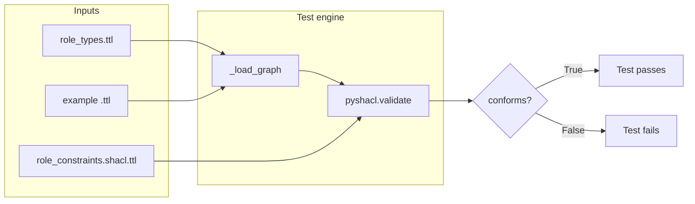

# Test Suite Guide: `test_role_disambiguation.py`

This document explains — in plain language — what the role disambiguation tests do, what parts of the system they exercise, and how they work under the hood.

---

## The problem in everyday terms

Imagine a hospital IT system where someone is logged in as **"Read Only User"** (they can view records but not change them), their HR file says they are a **Doctor** (their job title), and in one specific patient visit they are **acting as the attending doctor for that encounter only**.

Those sound like three versions of "role," but they mean completely different things:

| Concept | Plain-English meaning | Example |
|---|---|---|
| **AccessRole** | What the *computer system* lets you do (permissions) | ReadOnlyUser, Updater, Admin |
| **OccupationalPost** | What *job* you hold in the organisation | Doctor, CaseWorker, Nurse |
| **ActorGuise** | How you are *acting right now* in one specific situation | "Jim as Doctor in encounter E1" |

Many systems collapse all of this into a single "role" field (Reader / Updater / Admin). That works until two systems talk to each other — then you get bugs like granting clinical authority because someone has an admin login, or blocking access because a job title was mistaken for a system permission.

The **role_disambiguation** module models these three ideas as **separate, non-overlapping concepts** and uses automated checks to make sure nobody accidentally merges them again.

---

## What this test file is for

`test_role_disambiguation.py` is an automated safety net. It does not test Python application logic in the usual sense. Instead, it:

1. Loads **semantic web data** (RDF graphs written in Turtle syntax).
2. Runs a **SHACL validator** (think: a strict rulebook checker for graph data).
3. Confirms that **good examples pass** and **deliberately bad examples fail**.
4. Confirms that the **ontology itself** declares the three role types as mutually exclusive.

If all three tests pass, you have evidence that the vocabulary, the rules, and the examples are aligned.

---

## Files the tests depend on

The test file lives inside `role_disambiguation/` and reads five sibling files:

```
role_disambiguation/
├── ontology/
│   └── role_types.ttl          ← The vocabulary (OWL ontology)
├── shacl/
│   └── role_constraints.shacl.ttl  ← The rulebook (SHACL shapes)
├── examples/
│   ├── jim_as_doctor.ttl       ← A CORRECT real-world-style example
│   └── agent_as_readonly.ttl   ← A DELIBERATELY WRONG example
└── tests/
    ├── test_role_disambiguation.py  ← The tests (this file)
    └── README.md                    ← You are here
```

### 1. `ontology/role_types.ttl` — the vocabulary

This file defines **what kinds of things exist** in the model:

**Classes (categories of thing):**

| Class | What it represents |
|---|---|
| `onto:Role` | Abstract parent — any kind of "role-like" concept |
| `onto:AccessRole` | System permission proxy (subclass of Role) |
| `onto:OccupationalPost` | Job/position in an organisation (subclass of Role) |
| `onto:ActorGuise` | Context-specific way someone is acting (subclass of Role) |

**Important OWL rule:** the three subclasses are declared **disjoint** via `owl:AllDisjointClasses`. In plain English: nothing in the real world (as modelled here) can be more than one of those three at the same time.

**Properties (relationships):**

| Property | From | To | Meaning |
|---|---|---|---|
| `onto:holdsPost` | `foaf:Person` | `OccupationalPost` | "This person holds this job post" |
| `onto:hasSystemRole` | `foaf:Agent` | `AccessRole` | "This agent has this system login permission" |
| `onto:actsInGuise` | `foaf:Agent` | `ActorGuise` | "This agent is acting in this specific guise" |

**Example individuals (named constants):**

| Individual | Type | Meaning |
|---|---|---|
| `onto:DoctorPost` | OccupationalPost | The job title "Doctor" |
| `onto:ReadOnlyUser` | AccessRole | The system permission "read only" |

### 2. `shacl/role_constraints.shacl.ttl` — the rulebook

SHACL (Shapes Constraint Language) is like a linter for graph data. It defines **shapes** — templates that say "if you claim to be X, you must also satisfy Y."

This file defines three shapes:

#### Shape 1: `onto:AccessRoleShape`

- **Applies to:** anything typed as `AccessRole`
- **Rule:** it must **not** also be typed as `OccupationalPost` or `ActorGuise`
- **Why:** a system permission label must never double as a job title or an encounter guise

#### Shape 2: `onto:PersonRoleShape`

- **Applies to:** anything typed as `foaf:Person`
- **Rule A:** at most one `onto:holdsPost` link (simplified — one active post per person in this model)
- **Rule B:** anything linked via `onto:hasSystemRole` must be typed as `AccessRole` only
- **Why:** a person's login permission must not accidentally point at a job title

#### Shape 3: `onto:GuiseSeparationShape`

- **Applies to:** anything typed as `ActorGuise`
- **Rule:** it must **not** also be typed as `AccessRole`
- **Why:** "Jim acting as Doctor in encounter E1" is not the same thing as "ReadOnlyUser"

### 3. `examples/jim_as_doctor.ttl` — the good example

This file tells a coherent story about **Jim**:

```
Jim is a Person
  ├── holdsPost → DoctorPost        (his job)
  ├── hasSystemRole → ReadOnlyUser  (his system login)
  └── actsInGuise → EncounterGuise_E1  (how he's acting in one visit)

EncounterGuise_E1 is an ActorGuise
  ("Jim as Doctor in encounter E1")
```

Each fact is kept in its own lane. Jim can be a Doctor by profession, have read-only system access, *and* act in a clinical guise for one encounter — without any of those being confused for the others.

### 4. `examples/agent_as_readonly.ttl` — the bad example (on purpose)

This file models a mistake an AI agent might make:

```
ConfusedRole is BOTH OccupationalPost AND AccessRole   ← VIOLATION

CareBot (an AI agent)
  └── hasSystemRole → ConfusedRole   ← inherits the mistake
```

The file is labelled as a deliberate violation. It exists solely to prove the rulebook catches this class of error.

---

## How the test harness works

Before the three test functions run, the file sets up paths and helper functions.

### Path constants

```python
ROOT      = role_disambiguation/
ONTOLOGY  = ROOT / "ontology" / "role_types.ttl"
SHACL     = ROOT / "shacl" / "role_constraints.shacl.ttl"
JIM       = ROOT / "examples" / "jim_as_doctor.ttl"
VIOLATION = ROOT / "examples" / "agent_as_readonly.ttl"
```

Paths are resolved relative to the test file location, so tests work regardless of where you run `pytest` from.

### Helper: `_load_graph(*paths)`

1. Creates an empty RDF graph using **rdflib**.
2. Parses each Turtle file into that graph.
3. Returns the merged graph.

Think of this as loading one or more `.ttl` files into a single in-memory database of facts (triples).

### Helper: `_validate(data_paths)`

1. Loads the **data graph** (ontology + example instance data).
2. Loads the **shapes graph** (SHACL rules) separately.
3. Calls **pyshacl.validate()** with:
   - `inference="rdfs"` — apply basic RDFS reasoning before checking (so subclass relationships are respected)
   - `advanced=True` — enable advanced SHACL features used by the shapes
4. Returns:
   - `conforms` — `True` if all rules pass, `False` if any violation is found
   - `report_text` — a human-readable explanation of violations (when any exist)



---

## The three tests, explained

### Test 1: `test_valid_jim_passes_shacl()`

**What it is trying to prove:**  
A correctly modelled person — with job, system permission, and encounter guise kept separate — satisfies all SHACL rules.

**What it loads:**

| File | Role |
|---|---|
| `ontology/role_types.ttl` | Vocabulary + `DoctorPost` + `ReadOnlyUser` definitions |
| `examples/jim_as_doctor.ttl` | Jim's instance data |

**How it is tested:**

1. Merge ontology + Jim example into one data graph.
2. Validate against SHACL shapes.
3. Assert `conforms is True`.

**Layman's pass criteria:**  
"If we describe Jim the right way, the rulebook has no complaints."

**What would cause failure:**

- Jim's `hasSystemRole` pointing at something that is not an `AccessRole`
- Jim having more than one `holdsPost` (under the simplified rule)
- Any node being typed as two of {AccessRole, OccupationalPost, ActorGuise} at once

---

### Test 2: `test_violation_agent_fails_shacl()`

**What it is trying to prove:**  
The rulebook actually catches mistakes — it is not a rubber stamp. A deliberately broken example must be rejected.

**What it loads:**

| File | Role |
|---|---|
| `ontology/role_types.ttl` | Vocabulary |
| `examples/agent_as_readonly.ttl` | Broken agent example |

**How it is tested:**

1. Merge ontology + violation example.
2. Validate against SHACL shapes.
3. Assert `conforms is False`.
4. Assert `report_text` is non-empty (there is an actual violation report to read).

**Layman's pass criteria:**  
"If someone merges a job title and a system permission into one thing, the rulebook catches it and says no."

**Which shape fires:**

`:ConfusedRole` is typed as both `OccupationalPost` and `AccessRole`. Because it is also typed as `AccessRole`, **AccessRoleShape** fires:

> "An AccessRole cannot simultaneously be an OccupationalPost or ActorGuise. These are separate constructs."

If `:CareBot` were a `foaf:Person`, **PersonRoleShape** would also complain that `hasSystemRole` points at something that is not a pure `AccessRole`.

**What would cause failure (of the test itself):**

- If the violation example were accidentally "fixed" so it conforms
- If SHACL shapes were removed or weakened

---

### Test 3: `test_disjoint_classes_enforced()`

**What it is trying to prove:**  
The ontology file itself — not just the examples — formally declares that the three role types cannot overlap. This is the foundation the SHACL rules build on.

**What it loads:**

| File | Role |
|---|---|
| `ontology/role_types.ttl` | OWL ontology only (no instance examples) |

**How it is tested (step by step):**

1. **DoctorPost ≠ ReadOnlyUser**  
   Confirms the two named example individuals are different URIs — not accidentally the same entity.

2. **DoctorPost is an OccupationalPost**  
   Reads the triple `(DoctorPost, rdf:type, OccupationalPost)` from the graph.

3. **ReadOnlyUser is an AccessRole**  
   Reads the triple `(ReadOnlyUser, rdf:type, AccessRole)` from the graph.

4. **AllDisjointClasses axiom exists**  
   Searches for a node typed as `owl:AllDisjointClasses`.

5. **Disjoint set membership is complete**  
   Reads the `owl:members` list and confirms it contains exactly:
   - `onto:AccessRole`
   - `onto:OccupationalPost`
   - `onto:ActorGuise`

**Layman's pass criteria:**  
"The dictionary itself says these three categories are mutually exclusive — not just the examples, and not just the linter."

**Why this test matters separately from SHACL:**

| Layer | Technology | What it guarantees |
|---|---|---|
| Ontology | OWL `AllDisjointClasses` | Logical impossibility of dual typing (for reasoners) |
| Examples + SHACL | pyshacl validation | Practical enforcement on real instance data |

Both layers should agree. This test ensures the OWL layer is wired correctly.

---

## Summary table: what each test covers

| Test | Primary concern | Key files | Expected result |
|---|---|---|---|
| `test_valid_jim_passes_shacl` | Happy path — correct modelling | ontology + `jim_as_doctor.ttl` | `conforms == True` |
| `test_violation_agent_fails_shacl` | Error detection — bad modelling | ontology + `agent_as_readonly.ttl` | `conforms == False` |
| `test_disjoint_classes_enforced` | Ontology structure — logical separation | ontology only | Disjoint axiom present and complete |

---

## How to run the tests

### Prerequisites

```bash
pip install pyshacl rdflib pytest
```

### Run the full test module

```bash
pytest role_disambiguation/tests/test_role_disambiguation.py -v
```

### Run the entire tests folder

```bash
pytest role_disambiguation/tests/ -v
```

### Expected output

```
test_valid_jim_passes_shacl ............... PASSED
test_violation_agent_fails_shacl ............ PASSED
test_disjoint_classes_enforced .............. PASSED

3 passed
```

---

## What a failing test would mean (troubleshooting)

| Failing test | Likely cause |
|---|---|
| `test_valid_jim_passes_shacl` | Jim example or ontology was changed in a way that breaks separation; SHACL shapes may have been tightened incorrectly |
| `test_violation_agent_fails_shacl` | Violation example was "fixed" or SHACL shapes were weakened/removed — the safety net no longer catches merged roles |
| `test_disjoint_classes_enforced` | `owl:AllDisjointClasses` axiom was removed or altered in `role_types.ttl`; or example individuals were retyped |

---

## Real-world analogy

Think of three different ID cards you might carry:

1. **Building access card** (AccessRole) — opens certain doors in the software system
2. **Employee badge job title** (OccupationalPost) — says "Doctor" on HR records
3. **Visitor lanyard for one meeting** (ActorGuise) — "Acting clinician for Room 4, 2–3 pm"

The tests verify two things:

- **Jim's story** uses all three cards correctly without pretending one card is another.
- **CareBot's mistake** — printing one card that says both "Doctor" and "Read Only User" — gets flagged at the door.

That is the entire purpose of `test_role_disambiguation.py`: automated proof that the role disambiguation model and its rules work as intended.
